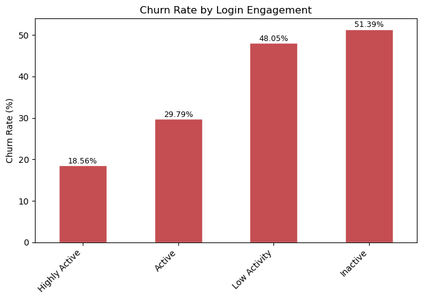

# Banking Customer Churn: Exploratory Data Analysis

**By: Curtis Smail**

## Executive Summary

The bank is losing roughly 27.25% of its customer base to churn, with no data-driven
way to flag at-risk customers before they leave. Using Excel, SQL, and Python, I
cleaned and analyzed 10,000 customer accounts to identify the strongest observed
churn signals. Engagement was the strongest signal — customers inactive for 90+ days
churned at 2.8× the rate of highly active ones — followed by single-product holdings,
complaint history, and substantially higher churn when multiple risk factors
overlapped. Combining these signals into a single risk score identified a targeted
22.92% of customers who churned at 2.2× the rate of everyone else, giving the bank a
concrete group to prioritize for retention outreach. Even high-value Premium
customers weren't immune — a meaningful subset showed the same risk pattern despite
the segment's favourable average. Notably, geography, gender, and marital status
showed no statistically significant relationship with churn, suggesting behavioural
signals may be more useful than demographics for retention targeting.

## Business Problem

The bank is losing an estimated 25-30% of its customer base to churn, and it
currently has no data-driven way to identify which customers are at risk of leaving.
Leadership needs to know: who is most likely to churn, why, and what early-warning
signals the bank should act on — so retention efforts can be targeted rather than
reactive.

## Methodology

1. **Excel**: Cleaned three related tables (customers, accounts, segments) —
   resolving inconsistent formatting, mixed date formats, and intentional
   referential integrity issues using manual formulas.
2. **SQL** (MySQL): Set up the schema, corrected data types, and ran an exploratory
   pass answering all 10 business questions directly against the cleaned data.
3. **Python**: Merged and validated the cleaned tables, engineered risk-related
   features, and went deeper — visualizations, chi-square and t-tests, and a
   combined risk-scoring model — to confirm and quantify what SQL surfaced.

## Skills

**Excel:** manual data cleaning, nested formulas for multi-format parsing
(currency/fraction/percentage), pivot tables, referential integrity checks

**SQL:** JOINs (inner/left), CASE statements, aggregate functions, GROUP BY, window
functions (NTILE), anti-joins for data quality checks, schema design

**Python:** pandas (merging, anti-joins, feature engineering), matplotlib
(visualization), scipy.stats (chi-square and t-tests), exploratory data analysis,
statistical interpretation

## Key Findings

1. **Engagement is the strongest churn signal.** Inactive customers (no login in
   90+ days) churn at 51.39%, vs. 18.56% for the most active — a 32.83
   percentage-point gap, the largest found (chi-square p < 0.001).
2. **Combined risk factors identify a substantially higher-risk group.** Customers
   with 3+ risk factors (engagement, single product, complaints, $0 balance, short
   tenure) churn at 46.55%, vs. 21.53% for everyone else — a stronger signal than
   any single factor alone.
3. **Single-product customers are a flight risk.** 36.84% churn vs. 22.01% for
   customers holding 2–4 products — and this group is also lower-value on average.
4. **Complaints are strongly associated with churn**, from 20.48% at 0 complaints
   to 40.52% at 3–4 complaints (p < 0.001).
5. **Premium customers aren't uniformly safe.** While Premium churns at 22.28%
   overall, 12.44% of Premium customers meet 3+ risk factors and churn at 35.83% —
   1.6× the segment average.

**Ruled out:** Geography (p = 0.876), gender (p = 0.410), marital status
(p = 0.169), and credit score (p = 0.460) showed no statistically significant
relationship with churn.

**Note:** the initial SQL exploration (Q8–Q9) used a 2+ factor threshold to flag high
risk; the Python analysis tightens this to 3+ factors for a more actionable, higher-
precision group — all "risk group" figures cited in this README and the Key Metrics
table use the 3+ threshold unless otherwise noted.

## Key Metrics

| # | Metric | Value |
|---|---|---|
| 1 | Overall churn rate | 27.25% |
| 2 | Highly Active vs. Inactive engagement | 18.56% – 51.39% |
| 3 | 3+ risk factors vs. fewer | 46.55% – 21.53% |
| 4 | 0 vs. 3–4 complaints | 20.48% – 40.52% |
| 5 | 1 product vs. 2–4 products | 36.84% – 22.01% |
| 6 | High-risk Premium customers | 35.83% |

*Full list of key metrics table with all 13 metrics available in the [notebook](notebooks/churn_eda.ipynb).*

## Recommendations

1. **Build an engagement-based early-warning trigger** — flag customers at the
   30- and 90-day login-gap thresholds for proactive outreach, before they reach
   the 51.39% churn tier.
2. **Use the 3+ risk-factor score as the primary retention targeting list** — it
   outperforms any single factor and identifies an actionable 22.92% of customers.
3. **Prioritize cross-sell for single-product customers** — this group has both
   higher churn and lower average balances, making it a strong target for product
   education.
4. **Treat every complaint as a retention touchpoint** — fast resolution and
   follow-up after a first complaint could provide an opportunity to intervene
   before churn risk increases further.
5. **Build a specific monitoring view for high-risk Premium customers** — high
   account value does not protect against the same behavioural risk factors seen
   bank-wide.

## Next Steps

1. **Convert the rule-based risk score into a validated predictive model** — fit a
   logistic regression (or similar interpretable model) on the risk factors
   identified here, using a train/test split, and benchmark its precision/recall/
   ROC-AUC against the current 3+-factor heuristic to quantify how much a fitted
   model improves on simple flag-counting.
2. **Build a dashboard for the engagement early-warning trigger** — a Tableau/
   Power BI (or Python/Streamlit) view that flags customers crossing the 30-day
   and 90-day login-gap thresholds in real time, with drill-down by segment and
   risk-factor count, so retention teams can action the 22.92% high-risk group
   directly.
3. **Estimate revenue-at-risk and retention ROI** — use average balance and
   estimated salary by risk group (already computed in Q8) alongside an assumed
   outreach success rate to size the dollar impact of reducing churn in the
   high-risk segment by even 5–10 percentage points.

## Data & Data Quality Notes

The dataset used in this project is synthetically generated to simulate real-world
retail banking operations. It models a 1:1 relationship between customers and accounts
as a simplifying assumption for this exercise to keep the analysis scoped to customer-
level churn. While the account balances, credit scores, transaction histories, and
churn markers are artificial, the dataset was engineered to mirror realistic
consumer behaviours, financial patterns, and statistical anomalies. This project
serves as a proof of concept to demonstrate end-to-end data cleaning,
exploratory data analysis (EDA), and churn factor visualization techniques without
exposing proprietary bank assets or sensitive customer information. See
`data/data_dictionary.md` for full column definitions and a complete breakdown of
known data quality issues in the source data.

## How to Run

1. Clone this repository and install dependencies: `pip install -r requirements.txt`
2. Cleaned data is available directly in `data/cleaned/` — no database setup
   required to run the notebook
3. Open `notebooks/churn_eda.ipynb` and run all cells
4. To explore the SQL work, import the CSVs in `data/cleaned/` into MySQL and run
   `sql/schema_and_load.sql` followed by `sql/exploratory_queries.sql`
